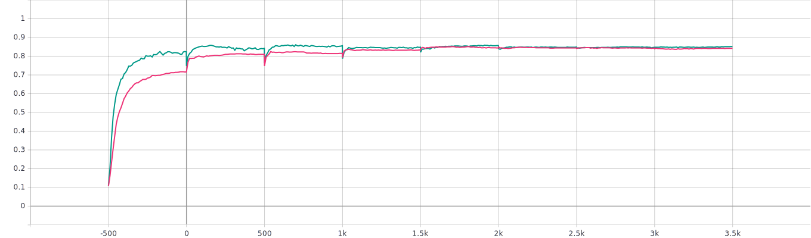

# Update (10/28/2019):

## Usage example:
python ex_MNIST.py --lr 1.e-2 --layers 5 --filters 8 --epochs 100 --h 1 --batch 100 --seed 1 --simulations 1 --theta 0.0 --beta 0 --fp_iters 0

# (10/28/2019):

## Usage example:

python ex_2.py --lr 1.e-4 --layers 2 --nodes 10 --epochs 500 --h 1.0 --batch_size -1 --theta 0.5 --levels 1 --seed 43

python ex_3.py --lr 1.e-4 --layers 2 --filters 1 --epochs 500 --h 1.0 --batch_size 200 --theta 0.5 --levels 1 --seed 43

## A few notes on the implementation:

- scipy is used for nonlinear (CG) and linear (lgmres) solvers. However, explicit gradients for the CG solver and matrix-vector products for the linear solver are evaluated using torch.autograd capabilities (using GPU when available). __There is a potential for optimizing this part of the code__

- number of CG iterations is limited to some reasonable number so that nonlinear solver does not necessarily converge to the true solution. It is not clear to me now if this is the right way to do it

- training can be done in multilevel fashion by going from "coarse" to "fine" time discretization (--levels option)

## Some observations on the performance:

- implicit code is obviously much slover. There is a lot of room for improvement here, not only for implementation but also for the design of a network itself (special structures with cheap solvers, preconditioners, etc.)

- the loss of implicit ResNet is often worse than that of ResNet but validation loss is usually better for identical architectures (but different \theta) with identical seeds

- typical behavior for the validation accuracy of classification (MNIST dataset of size 1000, red - \theta=0, green - \theta=0.5, number of layers doubled each 1000 epochs, step size h reduced correspondingly):

